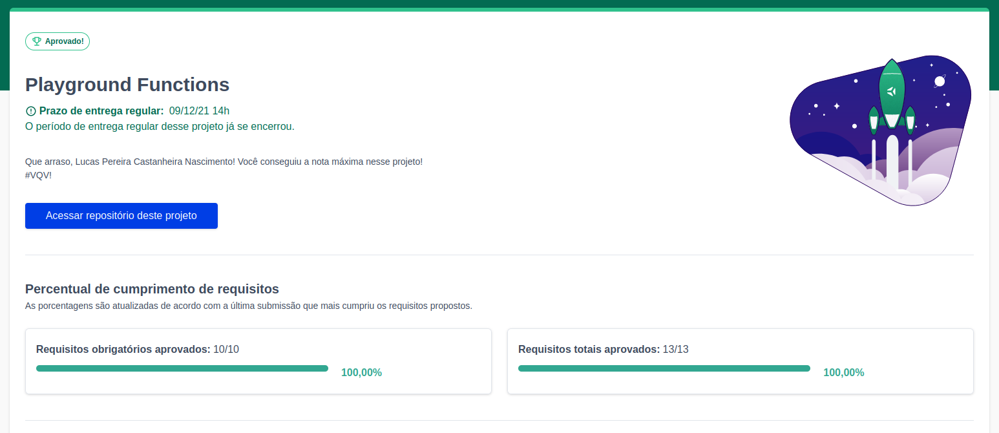

# Playground Functions

<h2>:brazil: Português :brazil:</h2>

Projeto entregue durante o curso de desenvolvimento Web ministrado pela <a href="https://www.betrybe.com" targe="_blank" rel="nofollow">Trybe</a>.

Obtive a aprovação no projeto, completando 100% dos requisitos obrigatórios e opcionais. Efetivando, assim, a conclusão do Bloco 4 (Introdução à JavaScript e Lógica de Programação) referente ao Módulo 1 (Fundamentos do Desenvolvimento Web).

Descrição:
 

O projeto tinha como objetivo elaborar diversas funções para treinar a lógica de programação

Habilidades desenvolvidas:

<ol>
<li>Escrever códigos em JavaScript que usam variáveis e tipos primitivos;</li>
<li>Utilizar conceitos da linguagem como a tipagem dinâmica e operadores lógicos/aritméticos/de atribuição no seu código;</li>
<li>Criar códigos que usam estruturas condicionais, como o if/else;</li>
<li>Manipular arrays (listas);</li>
<li>Utilizar o comando for;</li>
<li>Quebrar grandes problemas em pequenos;</li>
<li>Utilizar a lógica de programação na resolução de problemas;</li>
<li>Manipular objetos;</li>
<li>Utilizar o comando for/in;</li>
<li>Utilizar funções para organizar e estruturar o código;</li>
</ol>

<a href="https://www.linkedin.com/in/lucas-pereira-castanheira-nascimento-238355190/" targe="_blank" rel="nofollow">Meu Linkedin</a>.

 

<h2>:us: English :us:</h2>

Project delivered during the Web development course taught by <a href="https://www.betrybe.com" targe="_blank" rel="nofollow">Trybe</a>.

I passed the project, completing 100% of mandatory and optional requirements. Thus, completing Block 4 (Introduction to JavaScript and Programming Logic) referring to Module 1 (Fundamentals of Web Development).

Description:

The project aimed to develop several functions to train the programming logic

Skills Developed:

<ol>
<li>Write JavaScript code that uses variables and primitive types;</li>
<li>Use language concepts such as dynamic typing and logical/arithmetic/assignment operators in your code;</li>
<li>Create code that uses conditional structures, such as if/else;</li>
<li>Manipulate arrays (lists);</li>
<li>Use the for command;</li>
<li>Breaking big problems into small ones;</li>
<li>Use programming logic to solve problems;</li>
<li>Manipulate objects;</li>
<li>Use the for/in command;</li>
<li>Use functions to organize and structure the code;</li>
</ol>

<a href="https://www.linkedin.com/in/lucas-pereira-castanheira-nascimento-238355190/" targe="_blank" rel="nofollow">My Linkedin</a>.

